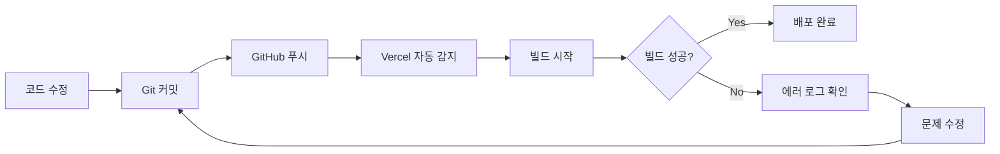

# Vercel 배포 가이드

이 문서는 모노레포 구조의 Next.js 애플리케이션을 Vercel에 배포하는 방법을 설명합니다.

## 📋 사전 준비사항

1. **GitHub 저장소**: 코드가 GitHub에 푸시되어 있어야 합니다
2. **Vercel 계정**: [vercel.com](https://vercel.com)에서 계정 생성
3. **환경 변수 준비**: `.env.local` 파일의 환경 변수들을 Vercel에 설정할 준비

---

## 🚀 배포 단계

### 1단계: 코드 커밋 및 푸시

```bash
# 변경사항 확인
git status

# 변경사항 스테이징
git add vercel.json
git add .  # 다른 변경사항도 있다면

# 커밋
git commit -m "fix: Vercel 배포 설정 수정"

# GitHub에 푸시
git push origin main
```

### 2단계: Vercel 프로젝트 생성/연결

#### 새 프로젝트인 경우:
1. [Vercel 대시보드](https://vercel.com/dashboard) 접속
2. **"Add New..."** → **"Project"** 클릭
3. GitHub 저장소 선택
4. 프로젝트 이름 설정

#### 기존 프로젝트인 경우:
1. Vercel 대시보드에서 프로젝트 선택
2. **Settings** 탭으로 이동

### 3단계: Root Directory 설정 (중요!)

**Settings → General → Root Directory**에서:

1. **"Edit"** 버튼 클릭
2. **`apps/web`** 입력
3. **"Save"** 클릭

> ⚠️ **중요**: Root Directory를 `apps/web`으로 설정해야 Vercel이 Next.js 앱을 올바르게 감지합니다.

### 4단계: 빌드 설정 확인

**Settings → General → Build & Development Settings**에서:

- **Framework Preset**: `Next.js` (자동 감지됨)
- **Root Directory**: `apps/web` (3단계에서 설정)
- **Build Command**: `npm run build` (vercel.json에서 자동 적용)
- **Install Command**: `cd ../.. && npm install` (vercel.json에서 자동 적용)
- **Output Directory**: (비워둠, Next.js 기본값 사용)

> 💡 `vercel.json` 파일이 있으면 자동으로 적용됩니다. 수동 설정보다 파일 설정이 우선됩니다.

### 5단계: 환경 변수 설정

**Settings → Environment Variables**에서 다음 환경 변수들을 추가합니다:

#### 필수 환경 변수

```bash
# 인증 설정
AUTH_PROVIDER=dev  # 또는 oidc, proxy_header, saml
SESSION_SECRET=your-production-secret-key-here  # 프로덕션용 랜덤 문자열 생성
NEXTAUTH_SECRET=your-nextauth-secret-here  # 프로덕션용 랜덤 문자열 생성
NEXTAUTH_URL=https://your-domain.vercel.app  # 배포 후 실제 도메인으로 변경

# 백엔드 API URL
NEXT_PUBLIC_API_URL=https://your-backend-api.com  # 실제 백엔드 API 주소
```

#### OIDC 인증 사용 시 (선택)

```bash
AZURE_AD_CLIENT_ID=your-azure-ad-client-id
AZURE_AD_CLIENT_SECRET=your-azure-ad-client-secret
AZURE_AD_TENANT_ID=your-tenant-id
ALLOWED_EMAIL_DOMAINS=hdec.co.kr  # 허용할 이메일 도메인
```

#### 프로덕션용 시크릿 생성 방법

```bash
# SESSION_SECRET 생성
openssl rand -base64 32

# NEXTAUTH_SECRET 생성
openssl rand -base64 32
```

#### 환경별 설정

각 환경 변수는 다음 환경에 적용할 수 있습니다:
- **Production**: 프로덕션 배포
- **Preview**: PR/브랜치 배포
- **Development**: 로컬 개발 (Vercel CLI 사용 시)

> ⚠️ **보안**: `.env.local` 파일은 Git에 커밋하지 마세요. `.gitignore`에 이미 포함되어 있습니다.

### 6단계: 배포 실행

#### 자동 배포 (권장)
- GitHub에 푸시하면 자동으로 배포가 시작됩니다
- Vercel 대시보드의 **Deployments** 탭에서 진행 상황 확인

#### 수동 배포
```bash
# Vercel CLI 설치 (최초 1회)
npm i -g vercel

# 프로젝트 루트에서 배포
vercel

# 프로덕션 배포
vercel --prod
```

### 7단계: 배포 확인

1. **Deployments** 탭에서 빌드 로그 확인
2. 빌드 성공 시 **"Visit"** 버튼으로 사이트 접속
3. 기능 테스트:
   - 페이지 로딩 확인
   - 인증 로그인 테스트
   - API 호출 확인

---

## 🔧 문제 해결

### 오류: "No serverless pages were built"

**원인**: Root Directory가 올바르게 설정되지 않음

**해결**:
1. Settings → General → Root Directory = `apps/web` 확인
2. `vercel.json` 파일 확인:
   ```json
   {
     "framework": "nextjs",
     "installCommand": "cd ../.. && npm install",
     "buildCommand": "npm run build"
   }
   ```

### 오류: "Missing script: build:web"

**원인**: Root Directory를 `apps/web`으로 설정했는데 루트의 `build:web` 스크립트를 실행하려고 함

**해결**:
- `vercel.json`의 `buildCommand`가 `npm run build`인지 확인
- Vercel 대시보드의 Build Command가 `npm run build`인지 확인

### 빌드는 성공했지만 페이지가 안 보임

**원인**: 환경 변수 누락 또는 잘못된 설정

**해결**:
1. Environment Variables 확인
2. `NEXTAUTH_URL`이 실제 배포 URL과 일치하는지 확인
3. 브라우저 콘솔에서 에러 확인

### 인증이 작동하지 않음

**원인**: NextAuth 설정 문제

**해결**:
1. `NEXTAUTH_URL`이 `https://`로 시작하는지 확인
2. `NEXTAUTH_SECRET`이 설정되어 있는지 확인
3. OIDC 사용 시 Azure AD 앱 등록의 Redirect URI 확인:
   - `https://your-domain.vercel.app/api/auth/callback/azure-ad`

---

## 📝 현재 설정 요약

### 프로젝트 구조
```
aidesignlab_website_final_really/
├── apps/
│   └── web/          # Next.js 앱 (배포 대상)
│       ├── app/
│       ├── package.json
│       └── next.config.js
├── package.json       # 모노레포 루트
└── vercel.json        # Vercel 설정
```

### vercel.json 설정
```json
{
  "framework": "nextjs",
  "installCommand": "cd ../.. && npm install",
  "buildCommand": "npm run build"
}
```

### 빌드 프로세스
1. Vercel이 `apps/web`을 프로젝트 루트로 인식
2. `cd ../.. && npm install`: 모노레포 루트로 이동해 워크스페이스 전체 설치
3. `npm run build`: `apps/web`에서 Next.js 빌드 실행
4. `.next` 폴더 생성 및 서버리스 함수 배포

---

## 🔄 배포 워크플로우



---

## 📚 참고 자료

- [Vercel 공식 문서 - Monorepos](https://vercel.com/docs/monorepos)
- [Next.js 배포 가이드](https://nextjs.org/docs/deployment)
- [Vercel 프로젝트 설정](https://vercel.com/docs/project-configuration)

---

## ✅ 체크리스트

배포 전 확인사항:

- [ ] `vercel.json` 파일이 올바르게 설정됨
- [ ] Root Directory가 `apps/web`으로 설정됨
- [ ] 모든 필수 환경 변수가 Vercel에 설정됨
- [ ] `NEXTAUTH_URL`이 실제 배포 URL과 일치함
- [ ] 프로덕션용 시크릿 키가 생성되어 설정됨
- [ ] 코드가 GitHub에 푸시됨
- [ ] Vercel 프로젝트가 GitHub 저장소와 연결됨

---

**마지막 업데이트**: 2026-02-20
